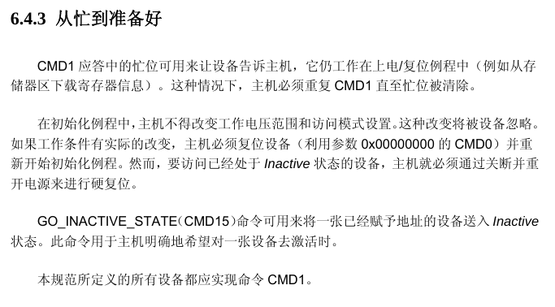
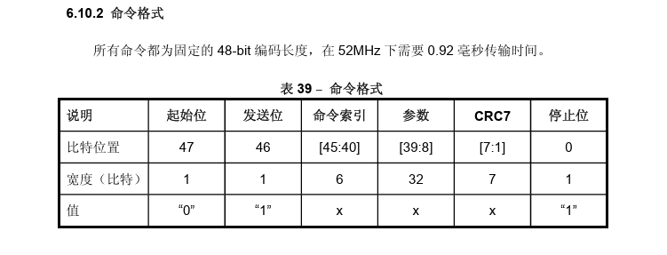
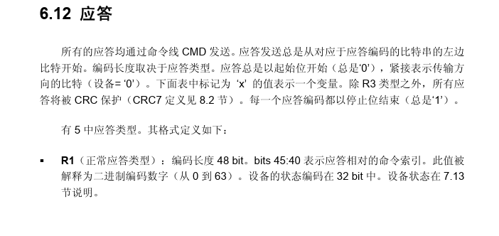
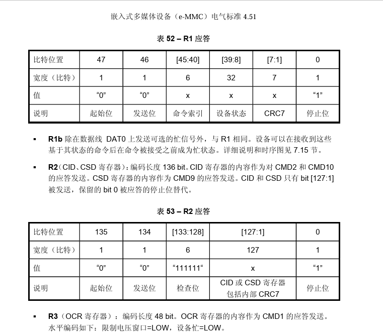
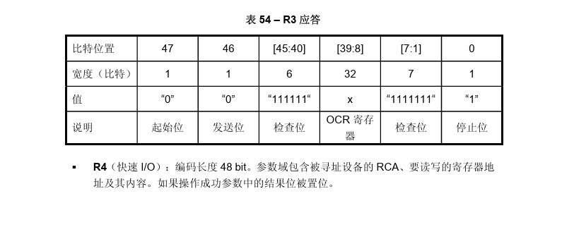
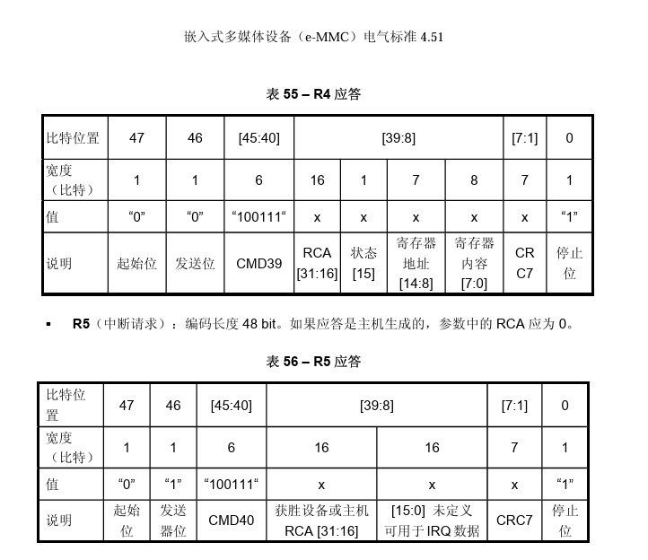
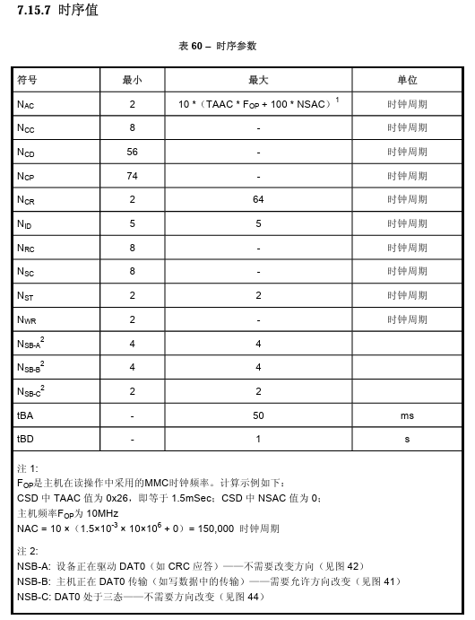

## eMMC初始化

## eMMC命令格式

## eMMC响应格式

## eMMC时序参数

## eMMC标准术语
- block：译为数据块，是flash中基本数据的传输单位。
- CID: Device IDentification register 设备识别寄存器，类似于我们的身份证号码。
- CLK: Clock signal，时钟信号。数据传输以处理都需要时钟信号，类似于心脏跳动，从而使各个器官运行。
- CMD: Command line or e•MMC bus command (if extended CMDXX)，指的是host对device传达的指令。
- CRC: Cyclic Redundancy Check 循环冗余校验，一种校验传输数据是否正确的方式。
- CSD: Device Specific Data register，用于保存EMMC运行期间的状态。
- DAT: Data line 数据传输总线，总共有8根（data0~data7），用于host和device之间双向传输数据。
- Data Strobe: Return Clock signal used in HS400 mode，该信号线是双向的，在data line 传输数据期间进行选通。类似于开关的功能。
- DISCARD: 是由host发出的命令，用于识别一些不需要的数据区域，比如现在手机永久了会提示内存不足，询问是否需要删除不需要的应用或者设备，此时我们选择不要的数据或者应用并点击OK后，host 就会识别到这些这些应用存在的数据区域进行内部设置mapping table,断开数据映射关系，等待GC。此外，还存在一种Trim 命令也用作删除数据。
- DDR: Dual data rate. 双倍速率传输，指的是数据会在时钟信号的上升沿和下降沿均进行传输。
- DSR: Driver Stage Register 驱动阶段寄存器，用于改变系统性能。
- D-VDD: cache(缓存) 的电压正极，
- D-VSS: cache(缓存) 的电压接地极，
- D-VDDQ: cache(缓存) 的IO(input/output) 电压正极，
- D-VSSQ: cache(缓存) 的IO(input/output) 电压接地极，
- e•MMC: 嵌入式多媒体卡，其cache可进行修改，同时支持单个引脚。
- e 2 •MMC: 嵌入式多媒体卡，其cache可进行修改，同时支持三个引脚。
- Empty Task Queue: 无任务队列，指的是device的任务队列中无任务的状态，类似于汽车的怠速状态。
- ERASE: 一种擦除操作，只是断开了逻辑映射关系，而没有擦除EMMC物理存储单元中的数据。
- Flash：一种可多次编程的非易失性存储器，非易失性指的是器件本身掉电后数据不会丢失。
- Group: 综合了擦除和写入保护单元的数据块，数据可以被写入。
- HS200: 高速接口时序模式，其数据在时钟频率为200MHz的情况下，使用单倍数据传输模式，数据传输速率达到200MB/s，I/O供电电压为1V8或者1V2
- HS400: 高速双倍数据接口时序模式，其数据在时钟频率为200MHz的情况下，使用双倍数据传输模式，数据传输速率达到400MB/s，I/O供电电压为1V8或者1V2。时钟频率超过50MHz 可被认为是高速信号。
- SDR和DDR的区别是SDR是Data line 总在时钟信号的上升沿传输数据，而DDR是Data line 在时钟信号的上升沿和下降沿均传输数据。所以SDR称为单倍速率，DDR称为双倍速率。
- ISI: 码间干扰。setup/hold余量不足，会使信号在传输过程中，每个UI之间的数据产生干扰，导致数据出错。
- OCR: Operation Conditions Register 操作条件寄存器。
- QSR: Queue Status Register 队列状态寄存器。
- RCA: Relative Device Address register 相对设备地址寄存器。
- SSO: Simultaneous Switching Output (referred as certain type of Noise)同步开关输出，参考同步开关噪声。
- TRIM: 一种可以从写入保护组中删除数据的命令，用于删除数据。trim 命令被执行后，读到该区域的数据为‘0’。

- Tuning Process: 调试处理，用于host端对输入信号进行调整，寻找合适的采样点，利于高速信号传输期间，保证采样数据的正确性。在device中有专门用于在HS200模式下，供tunning的调谐数据块。

- UI: 单元间隔，作为单bit数据传输时需要的时间。举例：在时钟频率为200MHz时，单倍数据传输模式下，一个UI=1/f=1/200MHz=5ns。而在双倍数据传输模式下，一个UI=1/f/2=1/200MHz/2=2.5ns。
